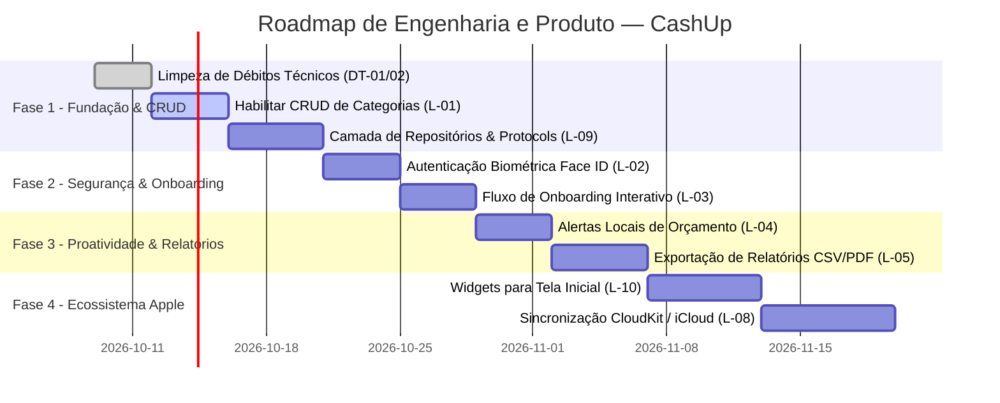

# 🔍 Auditoria Funcional, Gap Analysis & Roadmap — CashUp

**Documento**: Diagnóstico de Código, Mapeamento do Sistema Atual e Plano Evolutivo  
**Responsável**: Engenharia de Software & Arquitetura de Produto  
**Status do App**: v0.1 — Disponível na App Store  

---

## 1. O Que o Sistema Já Tem Implementado (Auditoria de Código)

A inspeção detalhada do código-fonte revelou um núcleo funcional sólido, com excelente aproveitamento dos recursos modernos do ecossistema Apple (SwiftUI, SwiftData e Combine):

```
┌────────────────────────────────────────────────────────────────────────┐
│                        MAPA DO ESTADO ATUAL                           │
├──────────────────────────┬──────────────────────────┬──────────────────┤
│ Módulo                   │ Funcionalidade           │ Status           │
├──────────────────────────┼──────────────────────────┼──────────────────┤
│ Transações & Despesas    │ Lançamento Despesa/Renda │ ✅ 100% Funcional│
│                          │ Recorrência Virtual      │ ✅ 100% Funcional│
│                          │ 3 Escopos de Exclusão    │ ✅ 100% Funcional│
│                          │ Formatação BRL / pt_BR   │ ✅ 100% Funcional│
├──────────────────────────┼──────────────────────────┼──────────────────┤
│ Categorias & Favoritos   │ Seed de 7 Categorias     │ ✅ 100% Funcional│
│                          │ Rastreamento usageCount  │ ✅ 100% Funcional│
│                          │ Top 6 Favoritos Dinâmicos│ ✅ 100% Funcional│
│                          │ Edição/Adição Customizada│ ⚠️ Código Coment.│
├──────────────────────────┼──────────────────────────┼──────────────────┤
│ Planejamento             │ Orçamento Mensal         │ ✅ 100% Funcional│
│                          │ Cópia de Mês (M+1)       │ ✅ 100% Funcional│
│                          │ Limpeza de Cat. Vazias   │ ✅ 100% Funcional│
│                          │ Zeramento em Lote        │ ✅ 100% Funcional│
├──────────────────────────┼──────────────────────────┼──────────────────┤
│ Dashboard (Home)         │ Métricas Consolidadas    │ ✅ 100% Funcional│
│                          │ Gráfico Diário Contínuo  │ ✅ 100% Funcional│
│                          │ Resumo por Categoria     │ ✅ 100% Funcional│
├──────────────────────────┼──────────────────────────┼──────────────────┤
│ Navegação Temporal       │ Sincronismo via Combine  │ ✅ 100% Funcional│
├──────────────────────────┼──────────────────────────┼──────────────────┤
│ Dicas & Educação         │ Tela Dicas (Regra 50/30) │ ⚠️ UI Estática   │
├──────────────────────────┼──────────────────────────┼──────────────────┤
│ Onboarding & Segurança   │ Splash Screen (2.5s)     │ ✅ 100% Funcional│
│                          │ Biometria (Face ID)      │ ❌ Arquivo Vazio │
│                          │ Tour de Boas-Vindas      │ ❌ Arquivo Vazio │
└──────────────────────────┴──────────────────────────┴──────────────────┘
```

---

## 2. Diagnóstico Técnico de Oportunidades & Débitos de Código

Durante a análise técnica do repositório, foram identificados os seguintes débitos técnicos prioritários:

### DT-01 — Bloco Duplicado de Seed em `SeedData.swift`
- **Diagnóstico**: O método `popularDadosIniciaisSeNecessario` executa exatamente o mesmo bloco de busca e inserção de categorias e subcategorias **duas vezes consecutivas** no mesmo arquivo (linhas 258–315 e linhas 316–375).
- **Impacto**: Redundância de código e consultas desnecessárias no banco durante a inicialização.
- **Ação Recomendada**: Remover o segundo bloco duplicado, mantendo a função enxuta e com logging padronizado.

### DT-02 — Funcionalidades Comentadas em `CategoriesViewEdit.swift`
- **Diagnóstico**: As ações de adicionar novas categorias (`addNewCategoria`) e deletar categorias (`deleteCategoria`) estão inteiramente comentadas no código-fonte.
- **Impacto**: O usuário atualmente só consegue visualizar as categorias existentes, sem poder criar categorias personalizadas ou remover subcategorias que não utiliza.
- **Ação Recomendada**: Descomentar e finalizar a implementação do fluxo com sheet de criação e confirmação destrutiva.

### DT-03 — Arquivos Estruturais Vazios (Placeholders)
- **Diagnóstico**: Arquivos criados na árvore de pastas que contêm apenas cabeçalho de comentário ou corpo vazio:
  - `CashUp/Views/Boas Vindas/Biometria/AuthViewModel.swift` (vazio)
  - `CashUp/Views/Boas Vindas/Onboarding/OnboardingViewModel.swift` (vazio)
  - `CashUp/Views/Boas Vindas/Onboarding/OnboardingView.swift` (vazio)
  - `CashUp/Views/Boas Vindas/Biometria/BiometricView.swift` (apenas `Text("Logo")`)
  - `CashUp/Views/Dicas/TipsViewModel.swift` (vazio)
  - `CashUp/Views/Dicas/Tip.swift` (vazio)
- **Ação Recomendada**: Implementar as funcionalidades planejadas ou consolidar a árvore evitando arquivos zumbis.

### DT-04 — Contador de Uso Sem Decremento
- **Diagnóstico**: O contador `usageCount` é incrementado na criação de transações, mas não é recalculado nem decrementado caso o usuário exclua as transações vinculadas.
- **Impacto**: Com o passar do tempo, uma categoria que não é mais utilizada pode continuar aparecendo no atalho de favoritos.

---

## 3. Catálogo de Lacunas Funcionais (Gap Analysis)

| ID | Severidade | Título | Descrição |
|---|---|---|---|
| **L-01** | **Alta** | CRUD de Categorias Customizadas Desativado | Código de adicionar/deletar categorias comentado em `CategoriesViewEdit.swift`. |
| **L-02** | **Alta** | Ausência de Autenticação Biométrica | O app não oferece bloqueio por Face ID / Touch ID, deixando os dados financeiros expostos a quem tiver acesso ao aparelho destravado. |
| **L-03** | **Média** | Onboarding Interativo Inexistente | O usuário é jogado direto na Home sem uma explicação clara de como funciona o orçamento mensal e os atalhos. |
| **L-04** | **Média** | Falta de Alertas de Orçamento Excedido | Não há notificações locais avisando quando o usuário ultrapassa 80% ou 100% do teto de uma categoria planejada. |
| **L-05** | **Média** | Sem Exportação de Dados (CSV/PDF) | Usuário não tem como fazer backup externo nem exportar relatórios para declaração de imposto de renda ou controle em outras ferramentas. |
| **L-06** | **Média** | Módulo de Metas / Reservas Ausente | Não há funcionalidade dedicada para criar metas de economia (ex.: "Viagem de Fim de Ano", "Reserva de Emergência"). |
| **L-07** | **Baixa** | Moeda e Locale Fixos em BRL | Falta de suporte a outras moedas (USD, EUR) para estudantes que fazem intercâmbio no exterior. |
| **L-08** | **Baixa** | Sincronização via iCloud Desativada | Caso o usuário troque de iPhone, os dados locais do SwiftData não são sincronizados automaticamente via CloudKit. |
| **L-09** | **Baixa** | Desacoplamento de Repositórios | ViewModels operam diretamente sobre o `ModelContext`, limitando a cobertura de testes unitários isolados com mocks. |
| **L-10** | **Baixa** | Widget para iOS Home Screen | Não há widget para a tela de bloqueio ou tela inicial do iOS para inserção rápida de gastos em 1 toque. |

---

## 4. Roadmap Estratégico de Evolução (Fases 1 a 4)



### Fase 1: Estabilização de Engenharia & Categorias Customizadas (Imediato)
1. Corrigir a duplicação em `SeedData.swift`.
2. Finalizar a tela de edição de categorias, permitindo criação e exclusão com segurança.
3. Adotar formalmente a camada de **Repository Protocols** para blindar a testabilidade.

### Fase 2: Segurança e Experiência Inicial
1. Implementar o `AuthViewModel` e ativar Face ID / Touch ID com `LocalAuthentication`.
2. Construir o fluxo de Onboarding interativo para apresentar a filosofia de controle do app.

### Fase 3: Engajamento e Portabilidade
1. Notificações locais configuráveis para alertar quando uma categoria ultrapassar o teto orçado.
2. Gerador de extrato financeiro mensal exportável em PDF e planilha CSV.

### Fase 4: Ecossistema Apple Avançado
1. Widgets interativos para iOS com atalhos de lançamento rápido.
2. Sincronização entre múltiplos dispositivos via iCloud/CloudKit com SwiftData.
