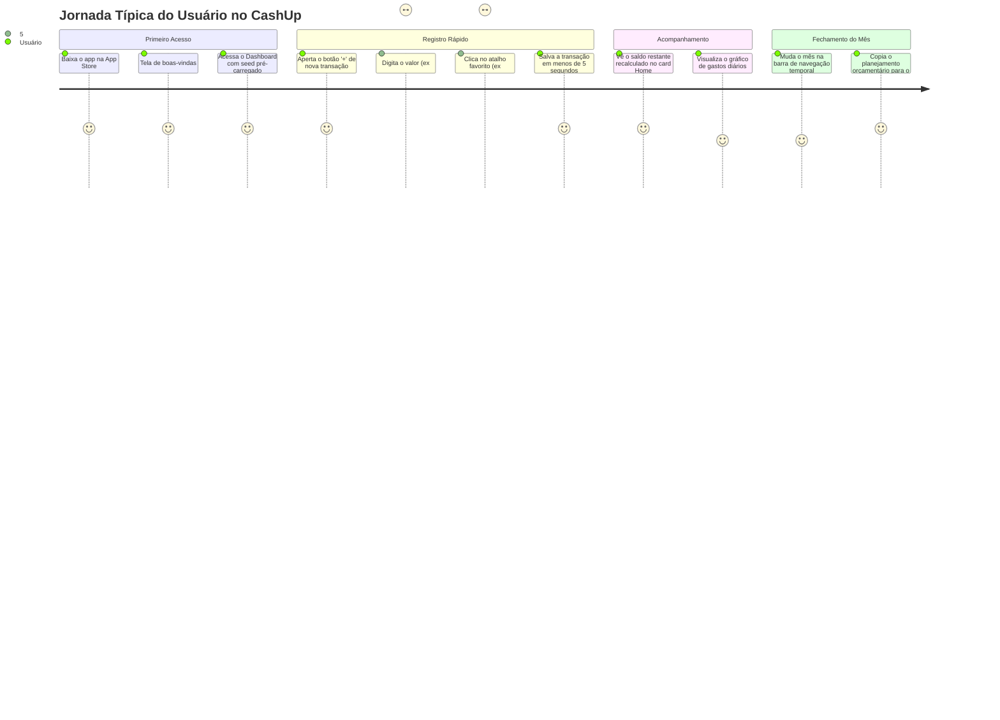

# 🎯 Visão de Produto — CashUp

**Produto**: CashUp — Organizador Financeiro Pessoal  
**Plataforma**: iOS Nativo (SwiftUI + SwiftData)  
**Status**: Publicado na App Store (Apple Developer Academy Project)  
**Público-Alvo**: Jovens universitários, estagiários e jovens profissionais em início de carreira  

---

## 1. Declaração de Visão e Missão

> **Visão**: Capacitar jovens a conquistarem autonomia e tranquilidade financeira através de uma ferramenta simples, visual, privativa e sem fricção.
>
> **Missão**: Transformar a relação do jovem com o dinheiro, substituindo o estresse e a burocracia de planilhas complexas por um acompanhamento diário leve e direto ao ponto no iPhone.

---

## 2. O Problema e a Oportunidade

### 2.1 O Cenário Atual
Ao ingressar na faculdade ou iniciar o primeiro estágio, jovens vivenciam o primeiro contato real com a gestão do próprio dinheiro: bolsas, mesadas, salários de estágio, custos com moradia dividida, alimentação universitária, transporte e saídas de fim de semana.

Nesse estágio, a maioria se depara com duas opções frustrantes:
1. **Planilhas complexas (Excel/Google Sheets)**: Exigem disciplina excessiva, digitação manual demorada e são péssimas para preenchimento rápido na rua ou entre aulas.
2. **Aplicativos de bancos tradicionais ou agregadores burocráticos**: Exigem conexão bancária com Open Finance (gerando desconfiança sobre privacidade de dados), cobram assinaturas mensais caras e focam em investimentos avançados, ignorando a necessidade primária de controle do dia a dia.

### 2.2 A Oportunidade do CashUp
O **CashUp** preenche essa lacuna como uma ferramenta **offline-first**, **100% privativa**, com **fricção mínima de registro** (menos de 5 segundos para registrar um gasto) e **feedback visual instantâneo** sobre o impacto daquele gasto no mês.

---

## 3. Proposta de Valor e Diferenciais Competitivos

```
      ┌────────────────────────────────────────────────────────┐
      │                      CASHUP VALUE                      │
      └────────────────────────────────────────────────────────┘
              │                           │
     ┌────────┴────────┐         ┌────────┴────────┐
     │ Fricção Mínima  │         │   Visibilidade  │
     │  no Registro    │         │    Intuitiva    │
     └─────────────────┘         └─────────────────┘
     • Top 6 categorias favoritas• Gráfico diário de ritmo
     • Teclado numérico direto   • Progresso visual (%)
     • Recorrência virtual       • Saldo restante de orçamento
              │                           │
     ┌────────┴────────┐         ┌────────┴────────┐
     │   Privacidade   │         │    Educação     │
     │    Absoluta     │         │   Financeira    │
     └─────────────────┘         └─────────────────┘
     • Dados locais (SwiftData)  • Regra 50/30/20 integrada
     • Sem login ou servidores   • Dicas práticas de consumo
```

### Principais Diferenciais:
- **100% Privativo & Local**: Os dados financeiros nunca saem do dispositivo do usuário. Sem intermediários, sem criação de conta obrigatória em servidores de terceiros.
- **Categorização Inteligente com Favoritos**: O sistema aprende a rotina do usuário através do contador de uso (`usageCount`), disponibilizando atalhos imediatos para as 6 subcategorias mais frequentes (ex.: Café, Restaurante, Transporte Público).
- **Recorrência sem Poluição de Dados**: Despesas fixas (como aluguel, academia, streaming) são projetadas virtualmente no calendário mensal sem inflar o banco de dados com centenas de registros futuros desnecessários.
- **Planejamento Orçamentário Flexível**: O usuário define tetos por categoria e subcategoria, podendo duplicar o orçamento para o mês seguinte com apenas um toque.
- **Identidade Dark Mode Nativa**: Interface desenhada com alto contraste, paleta escura elegante e ícones vibrantes com SF Symbols para máxima legibilidade.

---

## 4. Personas e Perfis de Usuário

### Persona 1: O Universitário Estagiário (Persona Primária)
- **Nome**: Lucas, 21 anos.
- **Contexto**: Cursa Engenharia de Software, faz estágio de 30 horas semanais e recebe uma bolsa/salário de R$ 1.800,00.
- **Dores**:
  - Gasta muito dinheiro com almoços na faculdade, cafés e transporte por aplicativo sem perceber.
  - No dia 20 do mês, a conta já está quase zerada e ele não sabe para onde o dinheiro foi.
  - Tentou usar planilhas três vezes, mas abandonou todas na segunda semana.
- **Necessidades no CashUp**:
  - Abrir o app no ponto de ônibus, registrar o almoço em 4 toques e guardar o celular no bolso.
  - Bater o olho na tela inicial e ver em verde/vermelho quanto ainda pode gastar até o final do mês.

### Persona 2: A Jovem Profissional Autônoma (Persona Secundária)
- **Nome**: Beatriz, 24 anos.
- **Contexto**: Designer freelancer recém-formada, tem receitas variáveis ao longo do mês.
- **Dores**:
  - Incerteza sobre a previsibilidade financeira dos próximos meses.
  - Dificuldade para separar gastos fixos (softwares, aluguel) de gastos supérfluos.
- **Necessidades no CashUp**:
  - Registrar recebimentos esporádicos com data específica.
  - Copiar o planejamento de despesas fixas de um mês para o outro sem retrabalho.
  - Consultar a tela de Dicas para aplicar a distribuição orçamentária 50/30/20.

---

## 5. Jornada do Usuário (User Journey)



---

## 6. Módulos do Sistema e Escopo Funcional

| Módulo | Objetivo de Negócio | Status Atual |
|---|---|---|
| **Home (Dashboard)** | Visão panorâmica e consolidada da saúde financeira do mês corrente | ✅ 100% Funcional |
| **Transações & Despesas** | Registro, listagem e edição de receitas/despesas com recorrência | ✅ 100% Funcional |
| **Planejamento Orçamentário** | Definição de limites por categoria/subcategoria e cópia mensal | ✅ 100% Funcional |
| **Categorias & Subcategorias** | Gestão taxonômica de despesas com sistema de favoritos | ⚠️ Parcial (Edição desabilitada) |
| **Dicas Financeiras (Tips)** | Educação financeira e metodologia 50/30/20 | ⚠️ UI pronta / Modelo estático |
| **Boas-Vindas & Onboarding** | Apresentação de valor e guia inicial de configuração | ⚠️ Splash ativo / Onboarding vazio |
| **Segurança & Biometria** | Bloqueio do aplicativo via Face ID / Touch ID | ❌ Estruturado, não implementado |

---

## 7. Métricas de Sucesso do Produto (Product Metrics)

### 7.1 North Star Metric
* **Taxa de Dias Ativos com Registro no Mês (Monthly Active Logging Days)**: Média de dias por mês em que o usuário registra ao menos 1 transação.

### 7.2 KPIs de Engajamento e Qualidade
1. **Time-to-Log**: Tempo médio entre a abertura do aplicativo e a confirmação do salvamento da transação (Meta: `< 6 segundos`).
2. **Retenção D30**: Porcentagem de usuários que continuam abrindo o app 30 dias após a instalação (Meta: `> 35%`).
3. **Aderência ao Planejamento**: Porcentagem de usuários ativos que mantêm um orçamento mensal configurado (Meta: `> 50%`).
4. **Crash-Free Sessions**: Estabilidade em produção medida via métricas da App Store (Meta: `> 99.8%`).
